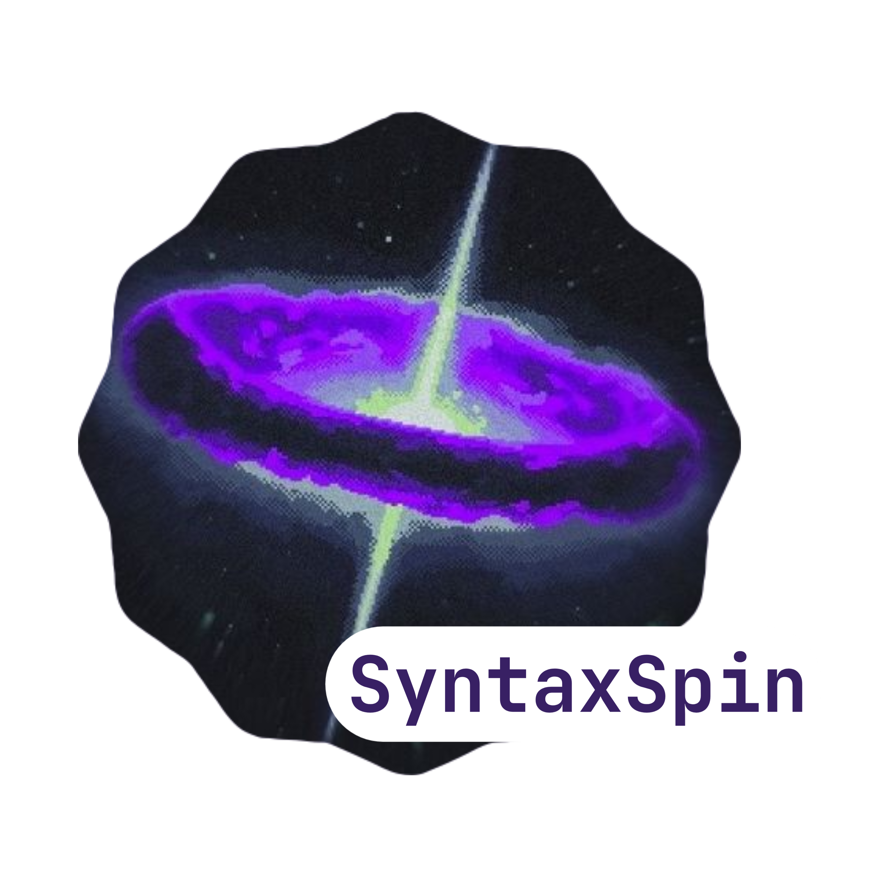

  

<!--[       

<!--### Developer's Quote

-->
### Software Used
 

### Friends & Collaborators & Contributed With
#### No one I have god only that guided me and Helped me

 
<b>Visitors Count</b>
  

 
 

  
   
  
  

